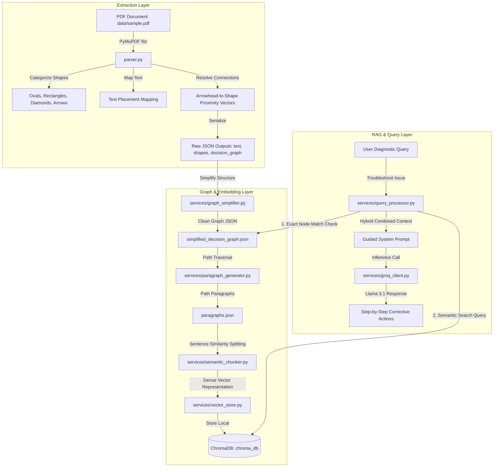

# PyMuPDF Flowchart Shape & Text Extractor API & RAG Troubleshooting Engine

A lightweight, high-performance Flask API, interactive dashboard, and command-line utility suite designed to parse PDF flowcharts using **PyMuPDF** (`fitz`). It extracts text blocks, maps shapes, reconstructs flowchart logical topology (nodes and edges connection graph) without OpenCV, and powers an AI-assisted RAG (Retrieval-Augmented Generation) troubleshooting pipeline.

---

## 🏗️ Project Architecture

The application is structured as a three-layered data and query pipeline:



### 1. Extraction Layer

* **Shape Classification**: Uses PyMuPDF's drawing command paths to identify ovals and circles (Start/End Terminals via Bezier curve `c` commands), diamonds (Decision boxes via 4 tilted segments), and rectangles (Process boxes via `re` commands).
* **Text-to-Shape Mapping**: Resolves multi-line reading order inside flowchart boxes by sorting coordinate spans inside the shapes' boundary boxes.
* **Arrow Topology**: Reconstructs connection lines by checking distance vectors from arrowhead pointer tips to the nearest box boundaries, mapping branching conditions (like `"YES"`, `"NO"`, `"ON"`, `"OFF"`).

### 2. Processing & Storage Layer

* **Simplification**: Strips coordinate noise (bounding boxes, stroke colors, geometry lists) to produce clean logical trees of node types and labeled transitions.
* **Path Serialization**: Recursively traverses the decision graph from Start terminals to leaf nodes (sinks) to generate full troubleshooting paragraphs describing every possible scenario.
* **Semantic Chunking**: Computes cosine distances between consecutive sentences using the `all-MiniLM-L6-v2` transformer model. It splits paragraphs into logical chunks when a semantic shift boundary is crossed (exceeding the 75th percentile of distances) or when reaching 600 characters. If the model fails to load, it falls back to a deterministic recursive character splitter.
* **Vector Indexing**: Registers text chunks and metadata (source document, page number, nodes traversed) into a local persistent ChromaDB database.

### 3. Query & LLM Execution Layer

* **Hybrid Context Retrieval**: When a query is sent, the system scans for exact node IDs or bracketed abbreviations (e.g. `[CB14]`) in the flowchart. If matched, it extracts paths crossing these nodes to prioritize topological graph correctness. It also executes semantic lookup in ChromaDB to retrieve relevant context.
* **AI Troubleshooting Generation**: Packages the retrieved context into a strict system prompt and queries the Groq Llama-3.1 model to retrieve concise, step-by-step corrective advice without hallucinations.

---

## 📂 Project File Structure

Every folder and file in the workspace has a distinct, dedicated purpose:

### 📁 Core Directories

* **[data/](<file:///c:/Users/ARN%20SOFT/Desktop/Flowchart1/data>)**: Contains source documents.
  * [data/sample.pdf](<file:///c:/Users/ARN%20SOFT/Desktop/Flowchart1/data/sample.pdf>): The default input PDF file containing industrial troubleshooting flowchart guides.
* **[services/](<file:///c:/Users/ARN%20SOFT/Desktop/Flowchart1/services>)**: Encapsulates the modular background services for RAG, database management, and LLM communication.
  * [services/\_\_init\_\_.py](<file:///c:/Users/ARN%20SOFT/Desktop/Flowchart1/services/__init__.py>): Standard package initialization file.
  * [services/graph_simplifier.py](<file:///c:/Users/ARN%20SOFT/Desktop/Flowchart1/services/graph_simplifier.py>): Strips geometric drawing details to extract clean logical decision graphs.
  * [services/paragraph_generator.py](<file:///c:/Users/ARN%20SOFT/Desktop/Flowchart1/services/paragraph_generator.py>): Translates logical path connections into sequential, natural language troubleshooting paragraphs.
  * [services/semantic_chunker.py](<file:///c:/Users/ARN%20SOFT/Desktop/Flowchart1/services/semantic_chunker.py>): Sentence-similarity splitter that divides text paths contextually with a fallback character-count chunker.
  * [services/vector_store.py](<file:///c:/Users/ARN%20SOFT/Desktop/Flowchart1/services/vector_store.py>): Encodes paragraph text using Sentence Transformers and writes/queries vector data in ChromaDB.
  * [services/query_processor.py](<file:///c:/Users/ARN%20SOFT/Desktop/Flowchart1/services/query_processor.py>): Coordinates the RAG hybrid pipeline, prioritizing direct node matches before applying semantic database retrieval.
  * [services/groq_client.py](<file:///c:/Users/ARN%20SOFT/Desktop/Flowchart1/services/groq_client.py>): Wrapper client for the Groq API to run queries using strict prompt structures.
* **`chroma_db/`**: Local SQLite database directory automatically managed by ChromaDB containing vector embeddings.

### 📄 Main Scripts

* **[parser.py](<file:///c:/Users/ARN%20SOFT/Desktop/Flowchart1/parser.py>)**: The main entry point script. It uses PyMuPDF to extract visual and text structures, maps flowchart shapes, creates the graphs, and triggers the indexing pipeline.
* **[app.py](<file:///c:/Users/ARN%20SOFT/Desktop/Flowchart1/app.py>)**: Exposes REST API endpoints and hosts a modern HTML/CSS interactive dashboard for chatting with the troubleshooting assistant.
* **[query_engine.py](<file:///c:/Users/ARN%20SOFT/Desktop/Flowchart1/query_engine.py>)**: A standalone CLI wizard allowing developers and users to interactively walk through flowchart steps (Yes/No/On/Off choices) in the terminal.
* **[groq_query.py](<file:///c:/Users/ARN%20SOFT/Desktop/Flowchart1/groq_query.py>)**: A CLI testing script that prompts users for queries, extracts pipeline context, and calls the Groq AI service.

### 📄 Data Outputs (Generated by `parser.py`)

* **`text.json`**: Raw text spans and bounding box coordinates extracted page-by-page.
* **`shapes.json`**: Extracted drawing coordinates, classifications, mapped text, and connection edge data.
* **`decision_graph.json`**: A raw connection tree (from node, to node, and label) for flowchart pages.
* **`simplified_decision_graph.json`**: Cleaned, simplified flowchart tree showing only logical nodes, logical types, and edge conditions.
* **`paragraphs.json`**: Logical troubleshooting pathways serialized into detailed prose paragraphs.

---

## 🚀 Installation & Requirements

Ensure you have Python 3.8+ installed. The project relies on the following packages:

```bash
pip install Flask PyMuPDF flask-cors networkx chromadb sentence-transformers numpy
```

---

## 💻 How to Run

### 1. Rebuild and Index the Database

If you modify `data/sample.pdf` or need to regenerate the JSON files and database, execute the parser:

```bash
python parser.py
```

### 2. Run the Interactive Troubleshooting CLI

To manually step through flowchart paths node-by-node:

```bash
python query_engine.py
```

### 3. Run the AI Groq CLI Troubleshooter

To run natural language search queries via CLI (requires your Groq API key):

```bash
python groq_query.py
```

### 4. Run the API Server & Dashboard Web UI

To launch the backend server:

```bash
python app.py
```

Open a browser and navigate to `http://127.0.0.1:5000/` to access the interactive troubleshooting chat dashboard.

---

## ⚡ API Endpoints

### 1. Service Status

* **URL**: `GET /status`
* **Response**:
  ```json
  {
    "status": "online",
    "message": "Flask PyMuPDF Parser Service running."
  }
  ```

### 2. Parse PDF

* **URL**: `GET /process` or `POST /process`
* **Parameters**:
  * `pdf_path` (Query string or JSON body parameter): Local path to the PDF file. Defaults to `data/sample.pdf`.
* **Response**:
  ```json
  {
    "success": true,
    "pdf_path": "C:\\Users\\ARN SOFT\\Desktop\\Flowchart1\\data\\sample.pdf",
    "total_pages": 8,
    "page_summary": {
      "1": { "shapes_paths": 14, "text_blocks": 27 }
    },
    "data": { "text": { ... }, "shapes": { ... } }
  }
  ```
# Flowchart-Parser

